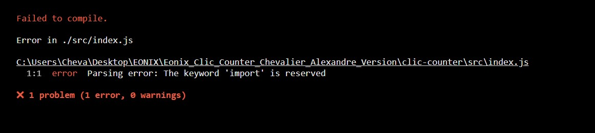
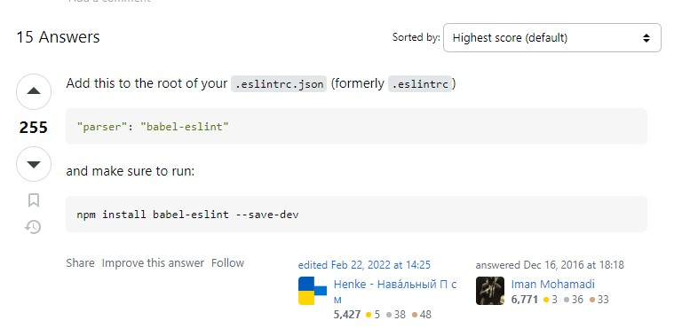

# Counter app

## Prerequirements
### Env
Clone the `.env.example` file into `.env`

## NPM run *scripts*
### Start project
To start the project, use the command `npm run start`

# 01 - Prise de connaissance du projet & Installation.

J'ai tout d'abord regardé avec attention le PDF fourni et j'ai structuré mon plan de travail en fonction de mon temps. J'ai tout d'abord cloné le repo git hub à l'aide de la commande dans un dossier local de ma machine :

 `git clone https://github.com/YOUR-USERNAME/YOUR-REPOSITORY`

J'ai ensuite créé mon propre repo sur mon Github en changeant l'origine et repoussant sur ce dernier : 

`git remote set-url origin https://github.com/GeckoP94/DEPOT-NAME `

Je me suis confronté à plusieurs erreurs lors de l'installation du projet avant de pouvoir le démarrer pour la première fois. 

Tout d'abord avec cette erreur :

Que j'ai résolu avec l'installation et l'import de babel-eslint :

Une fois, cela fait, j'ai effectué un `npm i` pour installer le projet et l'ensemble de ses dépendances, mais il y avait des dépendances trop vieilles du coup, j'ai lancé la commande :

`npm install --legacy-peer-deps`

Après quelques recherches et erreur dans la console je suis tombé sur cette video : https://www.youtube.com/watch?v=vn97BdYx2K8

Avec l'explication, j'ai compris que je devais set la config du legacy-peer-deps sur true, en exécutant la commande :

 `npm config set legacy-peer-deps true` 
 suivi d'un `npm i` et d'un `npm run start` 
 
Après la résolution de chaque step d'erreur remontée dans la console, j'ai pu démarrer et accéder au projet dans le localhost lors du `npm run start`   

#  ETAPE 02 - Construction du projet dans la HomeView.
### 01 - Incrémenter le bouton au clic 
La première partie consistait à faire fonctionner le compteur de sorte que le nombre s’incrémente à chaque clic. Après quelques recherche voici mon code issu de mon premier commit :

https://github.com/GeckoP94/Eonix_Clicker_Chevaler_Alexandre_Version/commit/2edd35e94459b13cccde00cd8d38e80beba0be6a

Resultat : https://youtu.be/2W7Ka2t6nIE

Cette partie m'a permis de revoir le `useState` qui permet d'avoir une variable d'état local sur laquelle je vais pouvoir effectuer des actions par la suite.

### 02 - Ajout de la décrémentation + ne pas aller en dessous de Zero 

Une fois cela fait j'ai fait une première version toujours en jouant avec le 'useState' et ajoutant le 'useEffect' pour avoir un contrôle sur l'affichage d'un message si en positif ou negatif.

https://youtu.be/kses5Ugg-dw

à ce moment le compteur allait encore en dessous de zéro.

____

Suite à cela, j'ai décidé de virer mon `useEffect` et la partie message car pas d'usage dans la partie finale.

Je me suis donc concentré sur ne pas passer le compteur en négatif.

Et j'ai donc déclaré 2 fonctions dans mon `useState` pour incrémenter et décrémenter le compteur en fonction de si la valeur du compteur est plus petite ou plus grande que 0 et ainsi ne pas passer en dessous.

J'ai appelé ces dernières sur mes boutons et j'ai passé le counter dans un div isolé.

Cela étant fonctionnel dans la HomeView j'ai ensuite appliqué le CSS à partir du design du site EONIX acutel.

#  ETAPE 03 - Création du composant - Import et test dans la HomeView.

Le code fonctionnant dans la Homeview, j'ai ensuite créé un dossier components dans lequel j'ai créé un fichier counter.js qui est mon composant, que j'ai ensuite importé dans la HomeView.

De cette manière la fonctionnalité est isolée et peut-être réutilisée ailleurs dans le futur. Ici en l'occurrence dans la HomeView.

#  ETAPE 04 - Création du test unitaire pour vérifier le fonctionnement de mon composant.

Pour conclure, je me suis attaqué à la rédaction du test unitaire. 

Dans certaines méthodes de développement on commence par la rédaction des tests en premier pour décrire tout ce que le composant devra faire avant de le coder.

Dans ce cas-ci, j'ai fait l'inverse, j'ai lancé par la suite la commande npm run test pour voir comment l'environnement allait réagir, j'ai ensuite installé l'ensemble des packages (jest, testing-library, etc...) manquant au fur et à mesure des messages d'erreur après avoir écrit la première ligne de mon test. 

Dans la première version, la condition de validation de l'incrémentation ne voulait pas se valider. En commentant cette dernière, le test était valide.

J'ai donc décidé de passer ma fonction de test en asynchrone et de la réécrire avec l'exemple de test fourni dans la documentation. 

https://testing-library.com/docs/dom-testing-library/api-async - 

De cette manière, mon code de test est plus court, 100% fonctionnel, plus lisible et maintenable.

